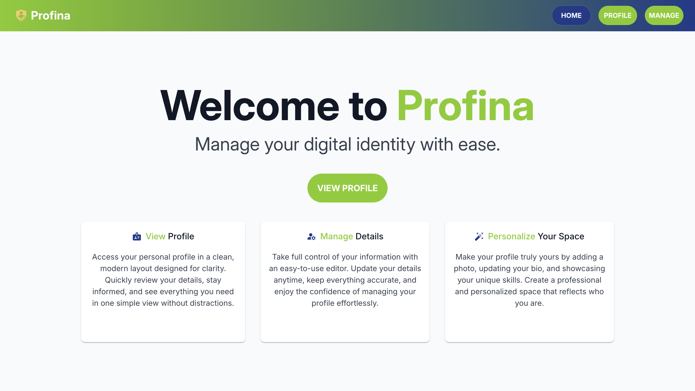
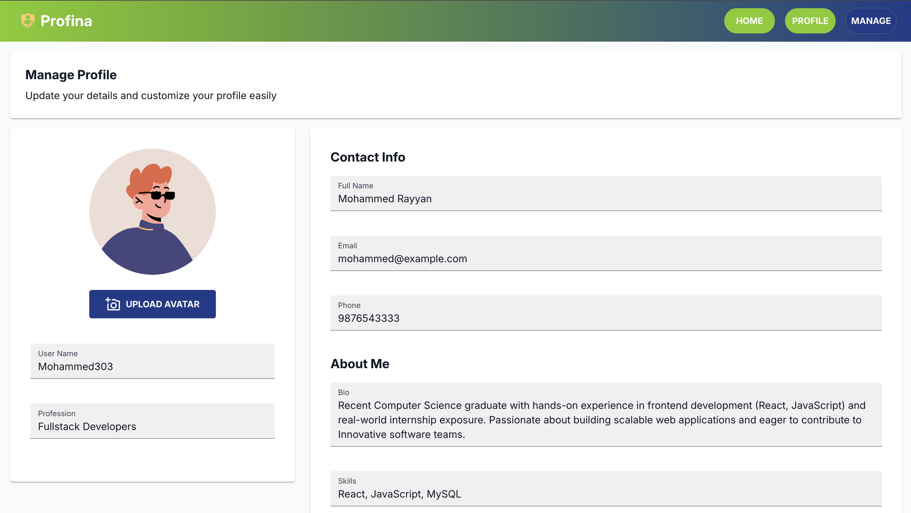

<p align="center">
  
</p>

# Profina — Profile Editor UI

**Profina** is a lightweight frontend web application for viewing and managing a digital user profile.  
It includes a landing page, profile viewer, and profile management interface, built using **React.js** and **Material UI** with a focus on clean layout, component structure, and UI interactions.

🔗 **Live Demo:** https://profina.vercel.app/

---

## 🚀 Tech Stack

<p align="left">
  
  
  
</p>

---

## ✨ Key Features

- **Landing Page** – Introduces the purpose and structure of the application  
- **Profile Page** – Displays user profile details in a read-only format  
- **Manage Profile Page** – Allows editing and updating profile data with immediate UI updates  
- **Component-Based UI** – Structured React components for maintainability  
- **Responsive Design** – Optimized for desktop and mobile screens  
- **Deployment** – Hosted on Vercel for fast builds and delivery  

---

## 📸 Screenshots

### Home Page
<p align="center">
  
</p>

### Profile Page
<p align="center">
  
</p>

---

## ⚙️ Installation & Setup

```bash
# Clone the repository
git clone https://github.com/mohammedrayyan-dev/Profina.git

# Navigate into the project folder
cd Profina

# Install dependencies
npm install

# Start development server
npm run dev

```
The app will be available at: 
👉 http://localhost:5173

---

👨‍💻 Author

**Mohammed Rayyan** <br />
Frontend Developer
